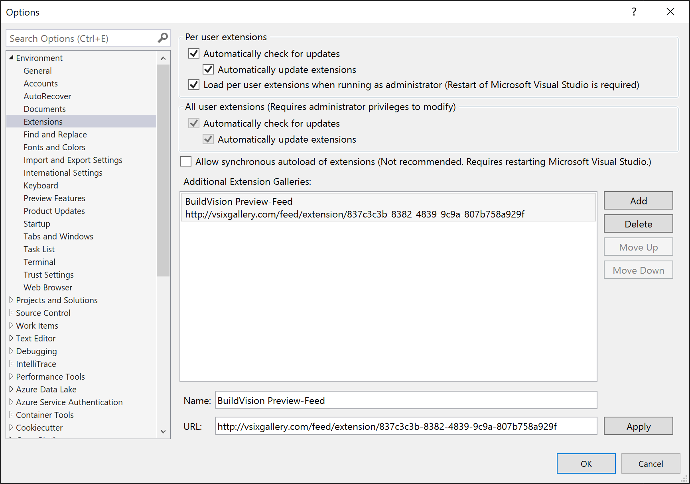
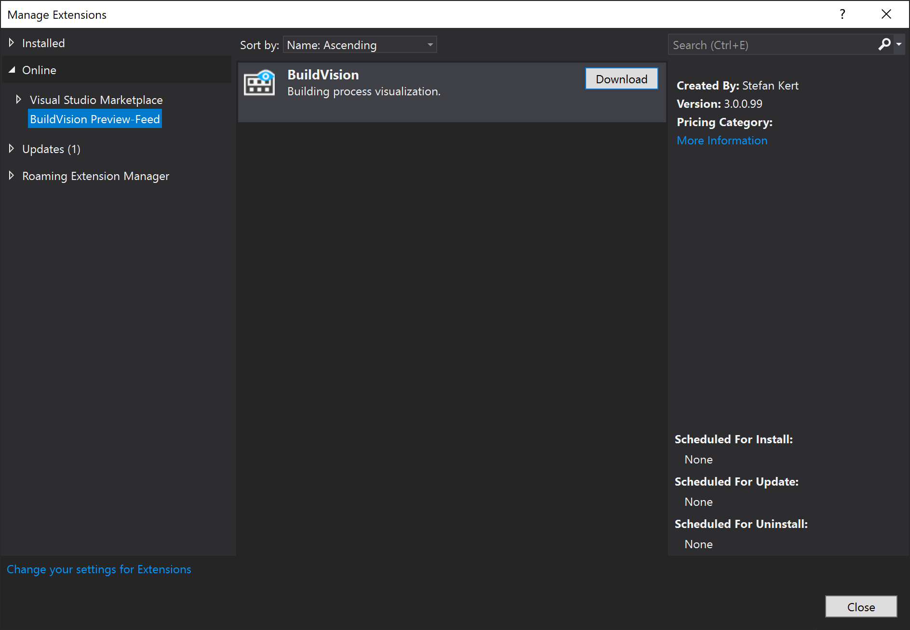

# BuildVision 
## A Visual Studio extension to visualize the building process.

You can grab the extension from [the Visual Studio Gallery](https://visualstudiogallery.msdn.microsoft.com/23d3c821-ca2d-4e1a-a005-4f70f12f77ba "BuildVision on the Visual Studio Gallery") (latest release).

All releases and pre-releases are available in [Releases](../../releases "BuildVision Releases on GitHub").

Supports Visual Studio 2015, 2017, 2019.

### Installation and startup
1. Install the VSIX package and restart Visual Studio.
2. Open BuildVision tool window from Main Menu: "View → Other Windows → BuildVision".

### Description
BuildVision activates when Visual Studio starts the process of building, rebuilding or cleaning projects (solution).

BuildVision tool window and Visual Studio Status Bar displays the current state of the process, for example: "Build solution 'MyApplication' started at 18:24:12 ..." or "Clean project 'MyProject' completed successfully at 18:25:20".

During the process, for each project the following columns are updated: State, Build Start Time, Build End Time, Elapsed Time, etc., as well as Errors, Warnings and Messages produced by MSBuild.

Indicators Panel, which is located above the table of projects, displays total number of errors, warnings and messages produced by MSBuild, the number of failed projects and successfully processed.

#### Screenshots

#### Configuring
You can configure BuildVision via "Tools → Options... → BuildVision".

### Preview Builds for BuildVision 
If you want to have the latest development state of BuildVision you can subscribe to the [VSIXGallery feed for BuildVision](http://vsixgallery.com/extension/837c3c3b-8382-4839-9c9a-807b758a929f/).

#### Setup Visual Studio for Preview Channel

1. In Visual Studio navigate to Tools -> Options -> Environment -> Extensions
2. Click the *Add* button
3. Confiure the right values for BuildVision Preview Feed as shown in the screenshot bellow
  - Name: *BuildVision Preview-Feed* (can be whatever fits you best) 
  - Url: http://vsixgallery.com/feed/extension/837c3c3b-8382-4839-9c9a-807b758a929f
4. Click apply

After you successfully added the VSIX Feed you should be able to install BuildVision through the Extensions dialog (Extensions -> Manage Extensions). You should be able to select *BuildVision Preview-Feed* and install BuildVision as shown in the screenshot bellow. You can also enable automated updates for the extension as with every extension from the marketplace.

Now you should be able to automatically receive updates for BuildVision as soon as a new version is pushed to the preview stream.
