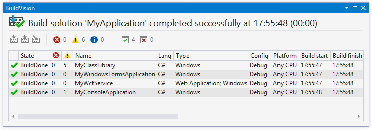
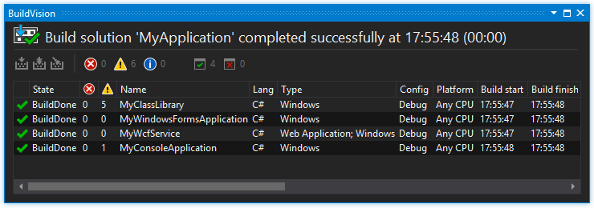
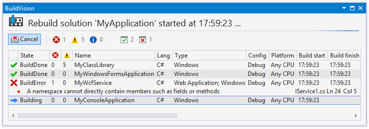
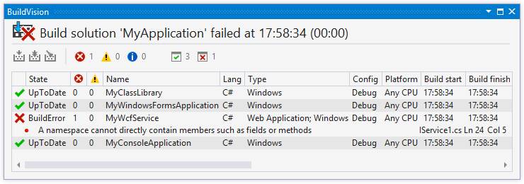

&nbsp;BuildVision
===========
A Visual Studio extension to visualize the building process.
 You can grab the extension from [the Visual Studio Gallery](https://visualstudiogallery.msdn.microsoft.com/23d3c821-ca2d-4e1a-a005-4f70f12f77ba, "BuildVision on the Visual Studio Gallery").

##### Screenshots

